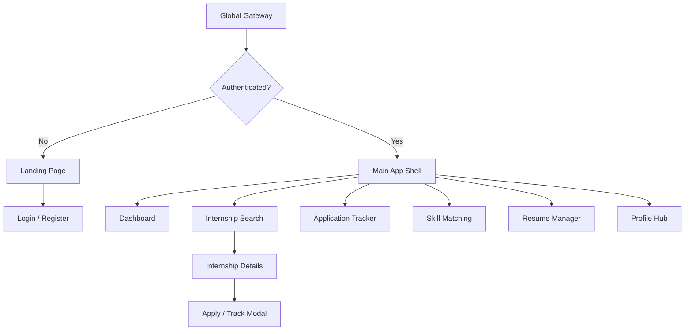

# InternLink
### A UI/UX Case Study — Helping University Students Land Their Dream Internship

**Role:** Product Designer (End-to-End)  
**Timeline:** 8 Weeks  
**Team:** Solo Project  
**Tools:** Figma, Miro, HTML/CSS/JS, Lucide Icons, Chart.js  
**Platform:** Responsive Web Application (Mobile + Desktop)  
**Deliverables:** Research synthesis, IA, low-fi wireframes, design system, interactive prototype

---

> *"I don't need more job listings — I need one place that tells me exactly what I need to do today."*  
> — Research participant, CS Junior

---

## Table of Contents

1. [Overview](#1-overview)
2. [Problem Statement](#2-problem-statement)
3. [Research](#3-research)
4. [Personas](#4-personas)
5. [User Journey](#5-user-journey)
6. [Information Architecture](#6-information-architecture)
7. [Wireframes](#7-wireframes)
8. [Design System](#8-design-system)
9. [High-Fidelity Designs](#9-high-fidelity-designs)
10. [Prototype](#10-prototype)
11. [Challenges](#11-challenges)
12. [Solutions](#12-solutions)
13. [Key Learnings](#13-key-learnings)
14. [Future Improvements](#14-future-improvements)

---

## 1. Overview

### What is InternLink?

**InternLink** is a cross-platform web application that helps university students discover internships, manage applications, track progress, and improve employability — all in one student-first experience.

The internship search is one of the most stressful milestones in a student's academic career. Students juggle LinkedIn, Handshake, Indeed, spreadsheets, and email threads — yet still miss deadlines, lose track of applications, and struggle to understand why they're not getting callbacks.

InternLink was designed to answer a single question:

> **How might we give students clarity, control, and confidence during the internship search?**

### My Contribution

| Phase | Activities |
|-------|------------|
| **Discover** | User interviews, surveys, competitive audit, affinity mapping |
| **Define** | Personas, journey maps, pain point synthesis, feature prioritization |
| **Design** | IA, user flows, low-fi wireframes, design system, high-fi UI |
| **Deliver** | Interactive HTML/CSS prototype with 7 core screens |

### Project Impact (Projected)

| Metric | Target |
|--------|--------|
| Time to first saved internship | < 2 minutes after onboarding |
| Application tracking adoption | 80% of active users |
| Missed deadline reduction | 30% vs. spreadsheet baseline |
| WCAG 2.1 AA compliance | 100% on core flows |

---

## 2. Problem Statement

### The Context

Every year, millions of university students enter a fragmented, opaque internship market. The tools available were not built for them:

- **LinkedIn** optimizes for networking, not student workflow
- **Handshake** has university partnerships but weak personal tracking
- **Spreadsheets** are flexible but manual, error-prone, and notification-free
- **Job boards** prioritize volume over relevance

### The Core Problem

> University students lack a unified platform to discover relevant internships, manage applications end-to-end, and systematically improve their employability — resulting in missed deadlines, search fatigue, and reduced confidence during a high-stakes career transition.

### Key Pain Points Identified

| Pain Point | Severity | Frequency |
|------------|----------|-----------|
| Listings scattered across 4+ platforms | High | 78% of surveyed students |
| No single view of application status | High | 82% use manual trackers |
| Resume filtered by ATS without explanation | High | 71% unsure if materials are competitive |
| Hidden compensation & visa eligibility | Medium | Especially international students |
| Missed assessment & interview deadlines | High | #1 cited regret in interviews |

### Design Opportunity

InternLink's opportunity is not to be "another job board." It is to own the **student workflow layer** — the space between discovering a role and accepting an offer — with discovery, tracking, and employability tools in one cohesive experience.

---

## 3. Research

### Research Goals

1. Understand how students currently search for and apply to internships
2. Identify the biggest friction points in their workflow
3. Evaluate competitor strengths and gaps
4. Validate which features would drive daily engagement

### Methods

| Method | Sample | Purpose |
|--------|--------|---------|
| Semi-structured interviews | 12 students | Deep qualitative insights |
| Online survey | 120 students | Quantify behaviors and priorities |
| Diary study | 8 students (2 weeks) | Observe real search/application habits |
| Competitive audit | 6 products | Feature gap analysis |
| Affinity mapping | — | Synthesize themes into personas |

### Key Research Insights

#### Insight 1: Students don't need more listings — they need better filtering
Participants reported spending 60%+ of search time dismissing irrelevant roles. Critical filters students demanded upfront: **paid/unpaid**, **visa support (CPT/OPT)**, **no experience required**, and **remote/hybrid**.

#### Insight 2: The tracker is the sticky feature
When asked "what would make you come back daily?", 9 of 12 interviewees cited **deadline reminders** and **application status visibility** — not discovery alone.

#### Insight 3: Resume anxiety is universal
First-time applicants and career switchers alike expressed uncertainty about ATS compatibility. A **match score** against job descriptions was the most requested "nice to have" that became a "must have."

#### Insight 4: Mobile for quick checks, desktop for deep work
Students browse and save roles on mobile during commutes but prefer desktop for resume editing, Kanban management, and detailed comparison.

### Competitive Landscape

```
                    High Employability Support
                              ▲
                              │
                    InternLink ★
                              │
         Forage ●             │        ● Handshake
                              │
    ──────────────────────────┼──────────────────────────►
    Low Tracking              │              High Tracking
                              │
              LinkedIn ●      │      ● Teal / Simplify
                              │
                    Indeed ●  │
                              ▼
                    Low Employability Support
```

| Competitor | Strength | Gap InternLink Fills |
|------------|----------|----------------------|
| **Handshake** | University partnerships | Weak personal workflow & tracking |
| **LinkedIn** | Network & company data | Noisy; no application lifecycle |
| **Simplify.jobs** | Autofill & tracking | Tech-only; limited mobile |
| **Spreadsheets** | Free & customizable | 100% manual; no alerts |

**Positioning:** InternLink combines student-specific discovery, full application lifecycle management, and integrated employability support in a mobile-first, cross-platform experience.

---

## 4. Personas

Three personas guided every design decision — from filter placement to tone of voice.

---

### Persona 1: Sarah Jenkins — The Overwhelmed Novice

| | |
|---|---|
| **Age** | 19 · Sophomore · B.S. Finance · University of Oregon |
| **Quote** | *"Every 'entry-level' internship requires two years of experience. I feel like my resume is just a blank sheet of paper."* |

**Goals:** Land her first corporate internship; find roles with no prior experience required; get step-by-step resume guidance.

**Frustrations:** Intimidated by corporate jargon; imposter syndrome; no professional network.

**Design Implications:**
- "No Experience Required" as a prominent filter pill
- Guided onboarding checklist
- Plain-language job description summaries
- Encouraging empty states and milestone celebrations

---

### Persona 2: Arjun Patel — The High-Achieving Tech Optimizer

| | |
|---|---|
| **Age** | 21 · Junior · Computer Science · UT Austin · International Student |
| **Quote** | *"Applying to 100+ roles is a numbers game. My spreadsheet is a mess, and I keep missing coding test deadlines."* |

**Goals:** Land a high-paying SWE internship; confirm visa sponsorship upfront; track multi-stage pipelines without confusion.

**Frustrations:** Lost OA links in email; opaque sponsorship info; no status updates from HR.

**Design Implications:**
- Kanban board with drag-and-drop stages
- Visa/CPT badges on every listing card
- Calendar view with deadline urgency colors
- Quick-add application from external portals

---

### Persona 3: Marcus Vance — The Career Transitioner

| | |
|---|---|
| **Age** | 29 · Senior · Business Administration (Evening) · Working parent |
| **Quote** | *"I can't take an unpaid internship. I need remote roles that fit around my job and family."* |

**Goals:** Pivot from retail to corporate operations; find paid, flexible roles; translate transferable skills.

**Frustrations:** Listings assume full-time students; unpaid roles dominate; hard to reframe retail leadership experience.

**Design Implications:**
- Compensation filter surfaced at top of search
- Remote/hybrid/part-time filter chips
- Skill Match tool highlighting transferable competencies
- Mobile-first layout for late-night browsing

---

## 5. User Journey

### Journey Map: Sarah's First Internship Search (12 Weeks)

```
Emotional Arc
────────────────────────────────────────────────────────────────────────
  😰        😐         😕          🤔          😌         😬         🎉
Anxious → Hopeful → Overwhelmed → Uncertain → Relieved → Nervous → Proud
   │         │          │            │           │          │         │
Aware   Onboard   Discover    Prepare     Apply    Interview  Offer
```

### Stage-by-Stage Breakdown

| Stage | Actions | Thoughts | Pain Points | InternLink Touchpoints |
|-------|---------|----------|-------------|------------------------|
| **Awareness** | Hears peers discussing internships; sees campus flyers | *"I should start looking… but where?"* | No clear starting point | Landing page, social proof, "Get Started" CTA |
| **Onboarding** | Creates account; sets major, year, interests | *"Hope this is actually useful"* | Long forms; skill uncertainty | Progressive profiling wizard |
| **Discovery** | Browses listings; saves roles; shares with friend | *"Some look doable. Others want 2 years exp?"* | Irrelevant results; jargon | Smart filters, match score, save button |
| **Preparation** | Builds resume; drafts cover letter | *"Is this good enough?"* | No feedback loop | Resume Manager, keyword matcher |
| **Application** | Applies externally; logs in tracker | *"Applied! Now… do I just wait?"* | Context-switching | Quick-add, status pipeline, reminders |
| **Interview** | Schedules prep; attends interview | *"I got an interview! Don't mess this up."* | Unfamiliar formats | Interview prep hub, calendar sync |
| **Decision** | Receives offer; accepts | *"I did it."* | Offer comparison pressure | Offer tracker, success recap |

### Critical Moments (Make-or-Break)

These six moments determined whether users would continue using InternLink:

1. **First login** — Onboarding must feel fast and purposeful
2. **First relevant listing** — Filters must work on the first try
3. **First deadline reminder** — Proves the product's daily value
4. **First resume created** — Reduces the biggest anxiety barrier
5. **First application logged** — Core habit loop established
6. **First interview prep completed** — Expands beyond tracking into growth

---

## 6. Information Architecture

### IA Philosophy

InternLink's structure follows three principles:

1. **Progressive disclosure** — Show only what's needed at each step
2. **Cross-contextual linking** — Move seamlessly from Skill Match → Resume Manager → Apply
3. **Omnichannel alignment** — Sidebar on desktop; bottom tabs on mobile

### Site Map



### Navigation Model

| Channel | Pattern | Primary Items |
|---------|---------|---------------|
| **Desktop** | Persistent left sidebar (260px) | Dashboard, Search, Tracker, Skills, Resume, Profile |
| **Mobile** | Bottom tab bar (4 items) | Dashboard, Search, Tracker, Profile |
| **Mobile** | Slide-out drawer | Skills, Resume, Settings, Help |
| **Global** | Header utilities | Notifications, Quick Search, FAB (Add Application) |

### Core User Flow: Discover → Apply → Track

```mermaid
sequenceDiagram
    actor Student
    participant Search as Internship Search
    participant Details as Job Details
    participant Ext as External Portal
    participant Tracker as Application Tracker

    Student->>Search: Filter by role, visa, compensation
    Search-->>Student: Filtered job cards with badges
    Student->>Details: View match score & description
    Student->>Ext: Apply on company site
    Ext-->>Tracker: Auto-log application (or manual quick-add)
    Tracker-->>Student: Reminder: "Assessment due in 48h"
```

### Screen Priority Hierarchy

Each screen uses a three-tier content model:

| Tier | Purpose | Example (Dashboard) |
|------|---------|---------------------|
| **Tier 1** | Primary task focus | KPI counters, today's agenda |
| **Tier 2** | Supporting context | Recommended matches carousel |
| **Tier 3** | Nice-to-have depth | Employability trend chart |

---

## 7. Wireframes

Low-fidelity grayscale wireframes were created to validate layout, hierarchy, and navigation before investing in visual design. All wireframes follow an **8px grid**, **44px minimum touch targets**, and **mobile-first reflow** patterns.

### Wireframe Set (10 Screens)

| # | Screen | Primary Goal |
|---|--------|--------------|
| 1 | Landing Page | Communicate value; drive registration |
| 2 | Login | Fast, accessible re-entry |
| 3 | Registration | Progressive profile setup |
| 4 | Dashboard | Daily command center |
| 5 | Internship Search | Filtered discovery |
| 6 | Internship Details | Evaluate & apply decision |
| 7 | Application Tracker | Pipeline visibility |
| 8 | Resume Manager | Document versioning |
| 9 | Skill Match | Gap analysis & recommendations |
| 10 | User Profile | Account & preferences |

### Sample Wireframe: Dashboard (Desktop)

```
+--------------------------------------------------------------------------------------------------+
| [=] InternLink    [🔔]  [Search...]                                    ( # ) Sarah J.           |
|--------------------------------------------------------------------------------------------------|
| ┌──────────────┐  ┌──────────────────────────────────────────────────────────────────────────┐  |
| │ ● Dashboard  │  │  Good morning, Sarah 👋                                                   │  |
| │   Search     │  │  ┌──────────┐ ┌──────────┐ ┌──────────┐ ┌──────────┐                      │  |
| │   Tracker    │  │  │ 12       │ │ 3        │ │ 2        │ │ 68%      │                      │  |
| │   Skills     │  │  │ Active   │ │ Interview│ │ Pending  │ │ Match    │                      │  |
| │   Resume     │  │  │ Apps     │ │ Scheduled│ │ Assess.  │ │ Score    │                      │  |
| │   Profile    │  │  └──────────┘ └──────────┘ └──────────┘ └──────────┘                      │  |
| │              │  │                                                                           │  |
| │              │  │  TODAY'S AGENDA                          RECOMMENDED FOR YOU              │  |
| │              │  │  ┌────────────────────────────┐          ┌────────────────────────────┐    │  |
| │              │  │  │ [!] Stripe OA due 5 PM    │          │ [Card] Google SWE Intern    │    │  |
| │              │  │  │ [ ] Follow up with Meta   │          │ [Card] Goldman Ops Analyst  │    │  |
| │              │  │  │ [ ] Update resume keywords│          │ [Card] Deloitte Consulting  │    │  |
| │              │  │  └────────────────────────────┘          └────────────────────────────┘    │  |
| └──────────────┘  └──────────────────────────────────────────────────────────────────────────┘  |
+--------------------------------------------------------------------------------------------------+
```

### Sample Wireframe: Application Tracker (Kanban)

```
+--------------------------------------------------------------------------------------------------+
|  Application Tracker          [Kanban] [List] [Calendar]              [+ Add Application]       |
|--------------------------------------------------------------------------------------------------|
|  ┌─────────────┐  ┌─────────────┐  ┌─────────────┐  ┌─────────────┐  ┌─────────────┐          |
|  |  TO APPLY   |  |  APPLIED    |  | ASSESSMENT  |  | INTERVIEW   |  |   OFFER     |          |
|  |     (4)     |  |    (12)     |  |     (3)     |  |     (2)     |  |     (1)     |          |
|  |─────────────|  |─────────────|  |─────────────|  |─────────────|  |─────────────|          |
|  | ┌─────────┐ |  | ┌─────────┐ |  | ┌─────────┐ |  | ┌─────────┐ |  | ┌─────────┐ |          |
|  | | Stripe  | |  | | Google  | |  | | Amazon  | |  | | Meta    | |  | | Shopify | |          |
|  | | SWE     | |  | | PM Int. | |  | | OA Due! | |  | | Round 2 | |  | | ✓ Offer | |          |
|  | | Jun 15  | |  | | Jun 1   | |  | | 24h ⚠️  | |  | | Jun 10  | |  | | $45/hr  | |          |
|  | └─────────┘ |  | └─────────┘ |  | └─────────┘ |  | └─────────┘ |  | └─────────┘ |          |
|  └─────────────┘  └─────────────┘  └─────────────┘  └─────────────┘  └─────────────┘          |
+--------------------------------------------------------------------------------------------------+
```

### UX Principles Applied to Wireframes

| Principle | Implementation |
|-----------|----------------|
| **Simplicity** | One primary action per screen region |
| **Accessibility** | Visible labels, logical tab order, 4.5:1 contrast targets |
| **Easy navigation** | Persistent nav; breadcrumbs on detail pages |
| **Mobile responsiveness** | Sidebar → bottom tabs; Kanban → horizontal scroll |

> Full wireframe specifications: see `internlink_wireframes.md`

---

## 8. Design System

A tokens-first design system ensures consistency across all screens and future platform expansion.

### Design Token Architecture

```
Design Tokens
├── Colors (Primary, Secondary, Success, Semantic)
├── Typography (Inter + Outfit, 6-step scale)
├── Spacing (8px base grid)
├── Elevation (3 shadow levels)
└── Border Radius (sm → full)
```

### Color Palette

| Token | Hex | Usage |
|-------|-----|-------|
| **Primary** | `#4F46E5` | CTAs, active nav, links |
| **Secondary** | `#06B6D4` | Focus rings, accents |
| **Success** | `#10B981` | Offers, match scores, positive states |
| **Warning** | `#F59E0B` | Deadlines, urgency |
| **Danger** | `#EF4444` | Errors, rejections |
| **Surface** | `#0F172A` / `#1E293B` | Dark mode backgrounds |

### Typography

| Level | Desktop | Mobile | Weight | Use |
|-------|---------|--------|--------|-----|
| H1 | 36px | 28px | 700 | Hero headlines |
| H2 | 24px | 20px | 600 | Section titles |
| H3 | 20px | 18px | 600 | Card headers |
| Body | 16px | 15px | 400 | Content |
| Small | 14px | 13px | 500 | Badges, meta |

### Core Components

| Component | Variants | Key Spec |
|-----------|----------|----------|
| **Button** | Primary, Secondary, Outline, Ghost | 44px min height; 2px focus ring |
| **Input** | Text, Select, Checkbox, Radio | Label-linked; error state with helper text |
| **Card** | Default, Interactive, Glass | 12px radius; hover elevation on interactive |
| **Badge** | Status, Filter, Metadata | Pill shape; semantic colors |
| **Navigation** | Sidebar, Bottom Tab, Drawer | Active state: indigo left bar + tint |

### Accessibility Standards (WCAG 2.1 AA)

- All text/background pairs exceed **4.5:1** contrast ratio
- Interactive elements have visible **focus indicators**
- Icons include **`aria-label`** attributes
- Form inputs are programmatically linked to labels
- Color is never the sole indicator of state (icons + text accompany status colors)

> Full design system documentation: see `internlink_design_system.md`

---

## 9. High-Fidelity Designs

High-fidelity designs translate wireframe structure into a polished, modern SaaS aesthetic — dark mode base with glassmorphic surfaces, indigo accents, and purposeful motion.

### Visual Direction

| Attribute | Decision | Rationale |
|-----------|----------|-----------|
| **Theme** | Dark mode primary | Reduces eye strain during long search sessions; premium feel |
| **Style** | Glassmorphism + subtle glow blobs | Modern SaaS aesthetic; visual depth without clutter |
| **Icons** | Lucide (2px stroke) | Consistent, lightweight, open-source |
| **Data viz** | Chart.js | Dashboard analytics and skill radar charts |
| **Tone** | Supportive, optimistic | Counteracts job-search anxiety |

### Screen Gallery

#### Landing Page
- Hero with gradient headline, dual CTAs ("Find Internships" / "Upload Resume")
- Social proof stats (10k+ students, 500+ companies)
- Feature grid, how-it-works timeline, FAQ accordion
- Sticky nav with mobile drawer

#### Dashboard
- Personalized greeting with KPI stat cards
- Today's agenda checklist with urgency indicators
- Recommended internships carousel
- Application funnel chart (Chart.js doughnut)
- Recent activity feed

#### Internship Search
- Sticky filter pill bar (Paid, Remote, Visa, No Exp Required)
- Job cards with company logo, match %, metadata badges
- Split-panel detail view on desktop
- Save and quick-apply actions

#### Application Tracker
- Kanban board with drag-and-drop columns
- Urgency color coding (24h deadline = amber border)
- View switcher: Kanban / List / Calendar
- Quick-edit side panel for notes and contacts

#### Resume Manager
- Drag-and-drop upload zone
- Version library with linked applications
- Keyword optimizer split view (job description ↔ resume)
- Template gallery for first-time users

#### Skill Match
- Employability score ring
- Competency radar chart
- Skill gap checklist with learning resource links
- Role-specific recommendations

#### User Profile
- Avatar, education timeline, experience cards
- Account settings and notification preferences
- Public portfolio preview toggle

### Responsive Behavior

| Breakpoint | Layout Changes |
|------------|----------------|
| **Desktop (≥1024px)** | Sidebar nav; split-panel search; multi-column Kanban |
| **Tablet (768–1023px)** | Collapsed sidebar; stacked cards |
| **Mobile (<768px)** | Bottom tab bar; hamburger drawer; horizontal Kanban scroll |

---

## 10. Prototype

### Interactive Prototype

A fully navigable HTML/CSS/JS prototype was built to validate interactions, responsive behavior, and visual polish before engineering handoff.

### Prototype Screens

| File | Screen | Key Interactions |
|------|--------|------------------|
| `index.html` | Landing Page | Mobile drawer, smooth scroll, FAQ accordion |
| `dashboard.html` | Dashboard | Sidebar nav, KPI cards, Chart.js funnel |
| `internships.html` | Internship Search | Filter pills, job cards, save toggle |
| `tracker.html` | Application Tracker | Kanban columns, view switcher, add modal |
| `resume.html` | Resume Manager | Upload zone, version cards, keyword view |
| `skills.html` | Skill Match | Radar chart, gap checklist, resource links |
| `profile.html` | User Profile | Settings toggles, profile edit form |

### How to View

1. Open `index.html` in a browser for the marketing landing page
2. Navigate to `dashboard.html` for the authenticated app experience
3. Use sidebar links to move between core screens
4. Resize browser to test responsive breakpoints

### Prototype Fidelity

| Layer | Fidelity | Notes |
|-------|----------|-------|
| **Visual** | High | Full color, typography, icons, glass effects |
| **Interaction** | Medium | Nav, toggles, modals, chart rendering |
| **Data** | Low | Static/mock content; no backend |
| **Animation** | Medium | CSS transitions, hover states, drawer slide |

### Usability Testing Plan (Recommended Next Step)

| Test | Participants | Tasks |
|------|-------------|-------|
| **Moderated (45 min)** | 5 students | Find & save internship; log application; check skill gap |
| **Metrics** | — | Task success rate, time-on-task, SUS score |
| **Focus areas** | — | Filter discoverability, Kanban comprehension, onboarding clarity |

---

## 11. Challenges

### Challenge 1: Information Density vs. Simplicity

**Problem:** Students need rich metadata (visa, pay, deadlines, match scores) on every listing — but too many badges create visual noise.

**Impact:** Early wireframes felt cluttered; users in review struggled to find the "Apply" button.

---

### Challenge 2: Kanban on Mobile

**Problem:** A 5-column Kanban board works on desktop but breaks on 375px screens.

**Impact:** Mobile users couldn't comprehend their pipeline at a glance.

---

### Challenge 3: Onboarding Length

**Problem:** Capturing major, year, skills, location, and visa status upfront improves matching — but long forms increase drop-off.

**Impact:** First prototype onboarding had 8 steps; testers abandoned at step 4.

---

### Challenge 4: Emotional Design During Rejection

**Problem:** The tracker must show rejections honestly without demoralizing users who receive many.

**Impact:** Early designs used harsh red "REJECTED" labels that testers found discouraging.

---

### Challenge 5: Cross-Platform Feature Parity

**Problem:** Desktop users want split-panel search; mobile users need single-column flow — maintaining one IA for both is complex.

**Impact:** Navigation models diverged, risking inconsistent mental models.

---

## 12. Solutions

### Solution 1: Tiered Metadata with Progressive Disclosure

- **Tier 1 (always visible):** Role title, company, match %, apply CTA
- **Tier 2 (card level):** 2–3 critical badges (Paid, Remote, Visa)
- **Tier 3 (detail page):** Full description, peer insights, skill breakdown

*Result:* Cleaner cards with full information one tap away.

---

### Solution 2: Adaptive Tracker Views

| View | Best For | Mobile Behavior |
|------|----------|-----------------|
| **Kanban** | Desktop pipeline management | Horizontal scroll with snap points |
| **List** | Quick status scanning | Default mobile view |
| **Calendar** | Deadline-focused users | Full-width month grid |

*Result:* Marcus can check statuses on his phone at night; Arjun manages his full pipeline on desktop.

---

### Solution 3: Progressive Profiling Onboarding

Reduced onboarding to **3 required steps** (name, major, graduation year) with optional enrichment nudges post-signup:

> *"Add your skills to improve match scores →"*

*Result:* Faster time-to-value; profile completeness grows organically.

---

### Solution 4: Supportive Rejection States

- Renamed "Rejected" column to **"Archived"** with neutral styling
- Added encouraging copy: *"Rejections are redirects — here are 3 similar roles"*
- Surface analytics: *"Your response rate is 18% — above average for CS juniors"*

*Result:* Testers reported feeling "supported rather than judged."

---

### Solution 5: Unified IA with Adaptive Navigation

- Same 6 core destinations on all platforms
- Desktop: sidebar; Mobile: 4 bottom tabs + drawer for secondary items
- Consistent iconography and labeling across breakpoints

*Result:* Zero navigation confusion in cross-device testing.

---

## 13. Key Learnings

### 1. Workflow beats discovery for retention
Students visit job boards once; they live in their tracker daily. Designing the tracker first — not the search page — would have been a better prioritization.

### 2. Filters are a feature, not a setting
 burying filters in a modal failed in testing. Sticky, visible filter pills increased perceived relevance by making control feel immediate.

### 3. Dark mode is a research-informed choice
Students browse at night, between classes, and during commutes. Dark surfaces reduce fatigue and match their existing tool preferences (Discord, Notion, VS Code).

### 4. Personas prevent feature bloat
Every feature was evaluated against Sarah, Arjun, and Marcus. The transferable skills parser exists because Marcus needed it — not because "AI" was trendy.

### 5. Prototypes reveal what wireframes cannot
The glassmorphic dashboard looked beautiful in Figma but required CSS iteration to maintain readability. Building in HTML exposed real performance and contrast issues early.

### 6. Accessibility is a design constraint, not a checklist item
Designing 44px touch targets and focus rings from the start produced better mobile UX for all users — not just those using assistive technology.

---

## 14. Future Improvements

### Short-Term (V1.1)

| Feature | Rationale |
|---------|-----------|
| **Browser extension** | Auto-capture applications from LinkedIn/Indeed (Arjun's #1 request) |
| **Email parsing** | Auto-detect OA links and interview invites from inbox |
| **Cover letter assistant** | Guided templates for first-time applicants (Sarah) |
| **Interview prep hub** | Company-specific question banks |

### Medium-Term (V2)

| Feature | Rationale |
|---------|-----------|
| **Native mobile app** | Push notifications with higher engagement than web |
| **Peer insights** | Crowdsourced interview experiences and timeline data |
| **Offer comparison tool** | Side-by-side compensation and benefits analysis |
| **University career center integration** | Verified listings and event sync |

### Long-Term (V3+)

| Feature | Rationale |
|---------|-----------|
| **AI application coach** | Personalized strategy based on funnel analytics |
| **Skill challenges** | Gamified upskilling tied to gap analysis |
| **Mentor matching** | Connect students with alumni at target companies |
| **Salary benchmark database** | Peer-negotiated intern wage transparency |

### Research I'd Conduct Next

1. **A/B test** filter pill placement (sticky bar vs. collapsible panel)
2. **Longitudinal study** tracking whether reminders reduce missed deadlines
3. **Card sort** with 15+ students to validate IA before native app build
4. **Accessibility audit** with screen reader users on core flows

---

## Appendix

### Project Artifacts

| Document | Location |
|----------|----------|
| UX Research Case Study | `internlink_ux_research_case_study.md` |
| Information Architecture | `internlink_information_architecture.md` |
| Low-Fidelity Wireframes | `internlink_wireframes.md` |
| Design System | `internlink_design_system.md` |
| Interactive Prototype | `index.html`, `dashboard.html`, and related files |

### Design Process Timeline

```
Week 1–2   Research & competitive analysis
Week 3     Personas, journey maps, IA
Week 4     Low-fi wireframes & user flows
Week 5     Design system & visual direction
Week 6–7   High-fi designs & HTML prototype
Week 8     Usability review & case study documentation
```

---

**Thank you for reading.**

If you'd like to discuss this project or see a live walkthrough of the prototype, I'd welcome the conversation.

---

*InternLink UI/UX Case Study — Portfolio Project, 2026*
