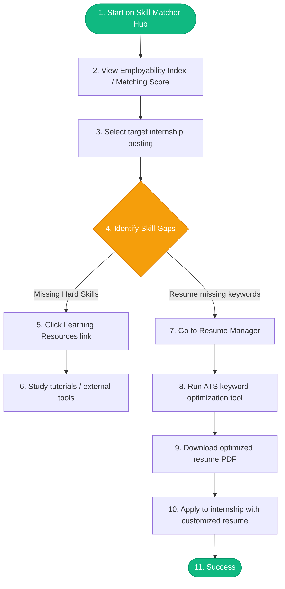

# InternLink Information Architecture (IA) Specification
### Structural Blueprints, Navigation Models, and Core User Flows

---

## 1. Information Architecture Philosophy & Strategy
InternLink’s Information Architecture is designed to prioritize **low cognitive load, high accessibility, and contextual relevance**. Given the anxiety-inducing nature of internship hunts, the platform utilizes three design principles:
* **Progressive Disclosure:** Hiding secondary utility elements behind context-driven menus and overlays while maintaining immediate focus on core workflows (e.g., searching, applying, and tracking).
* **Cross-Contextual Linking:** Allowing seamless transition between interrelated components (e.g., from discovering a skill gap in *Skill Matching* directly to optimizing a document in the *Resume Manager*).
* **Omnichannel Alignment:** Ensuring the layout transitions fluidly from a multi-column desktop sidebar view to a bottom-tabbed, gesture-driven mobile layout.

---

## 2. Site Map
The site map outlines the hierarchical structural organization of the InternLink web and mobile applications.

### Mermaid Site Map Diagram

```mermaid
graph TD
    %% Base Nodes
    Root[Global Gateway / Home] --> Auth{Auth Status?}
    
    %% Unauthenticated
    Auth -->|No| Landing[Landing Page / Marketing]
    Landing --> Login[Login / Sign Up]
    
    %% Authenticated
    Auth -->|Yes| AppRoot[Main Platform Shell]
    
    %% Level 1 Primary Navigation
    AppRoot --> Nav1[1. Dashboard]
    AppRoot --> Nav2[2. Internship Search]
    AppRoot --> Nav3[3. Application Tracker]
    AppRoot --> Nav4[4. Skill Matching]
    AppRoot --> Nav5[5. Resume Manager]
    AppRoot --> Nav6[6. Profile Hub]
    AppRoot --> Nav7[7. Notification Center]

    %% Level 2 & 3 Substructures
    %% Dashboard
    Nav1 --> Dash1[Daily Agenda checklist]
    Nav1 --> Dash2[Recent Matches carousel]
    Nav1 --> Dash3[Status KPI Highlights]
    
    %% Internship Search
    Nav2 --> Search1[Search / Filter Panel]
    Search1 --> JobDetails[Internship Details page]
    JobDetails --> ApplyFlow[Apply / Track modal]
    Nav2 --> Search2[Saved Roles]
    
    %% Application Tracker
    Nav3 --> Track1[Kanban Board View]
    Nav3 --> Track2[List View]
    Nav3 --> Track3[Calendar View / Deadlines]
    Nav3 --> Track4[Application Details Panel]
    
    %% Skill Matching
    Nav4 --> Skill1[Employability Index dashboard]
    Nav4 --> Skill2[Skill Gap Analysis]
    Nav4 --> Skill3[Recommended Learning Resources]
    
    %% Resume Manager
    Nav5 --> Resume1[Resume Upload & Parse]
    Nav5 --> Resume2[Keyword Matcher Tool]
    Nav5 --> Resume3[Resume Versions Library]
    
    %% Profile Hub
    Nav6 --> Profile1[Public Profile / Portfolio View]
    Nav6 --> Profile2[Education & Experience timeline]
    Nav6 --> Profile3[Account Settings & Preferences]
    
    %% Notification Center
    Nav7 --> Notif1[Actionable Alerts e.g. Interview Schedules]
    Nav7 --> Notif2[Promotional / Match Alerts]
    Nav7 --> Notif3[Notification Preferences]

    %% Styles
    classDef primary fill:#6366F1,stroke:#4F46E5,color:#FFF,stroke-width:2px;
    classDef secondary fill:#1E293B,stroke:#334155,color:#FFF;
    classDef gateway fill:#10B981,stroke:#059669,color:#FFF,stroke-width:2px;
    class Root,Auth,AppRoot gateway;
    class Nav1,Nav2,Nav3,Nav4,Nav5,Nav6,Nav7 primary;
    class Dash1,Dash2,Dash3,Search1,JobDetails,ApplyFlow,Search2,Track1,Track2,Track3,Track4,Skill1,Skill2,Skill3,Resume1,Resume2,Resume3,Profile1,Profile2,Profile3,Notif1,Notif2,Notif3 secondary;
```


---

## 3. Navigation Structure
To provide a seamless experience on both web (desktop) and mobile (iOS/Android), the navigation is optimized for form factor.

### Navigation Allocation Matrix

| Channel | Navigation Pattern | Included Items | Context & Behavior |
| :--- | :--- | :--- | :--- |
| **Desktop Web** | **Persistent Left Sidebar** | Dashboard, Search, Tracker, Skill Matcher, Resume Hub, Profile | Expanded by default; minimizes to icons to reclaim horizontal space on small screens. |
| **Mobile App** | **Bottom Tab Bar (Primary)** | Dashboard, Search, Tracker, Profile | Limited to 4 core actions to avoid clutter. Fits high-frequency thumb zones. |
| **Mobile App** | **Slide-out Drawer (Burger)** | Skill Matcher, Resume Hub, Settings, Help | Holds secondary utilities and resource tools. Triggered via top-left avatar tap. |
| **Omnichannel** | **Global Header Utilities** | Notifications (Bell icon), Quick Search, Quick-Add Floating Action | Desktop: Top-right header. Mobile: Header bar with prominent floating action button (FAB) for adding applications. |

> [!NOTE]
> The **Notifications (Bell)** and **Settings** are separated from the main navigation flow. Notifications is a modal slide-over panel on desktop and a dedicated screen on mobile to allow for immediate context preservation.

---

## 4. User Flow Diagrams
These flows map out critical paths taken by students to complete primary tasks.

### Flow 1: Job Discovery, Application, and Tracking
*This flow models how Arjun (the Tech Optimizer) finds an internship, submits an application, and updates his dashboard tracker.*

```mermaid
sequenceDiagram
    autonumber
    actor User as Student
    participant Search as Search & Filter Page
    participant Details as Job Details Page
    participant Ext as Apply / External Portal
    participant Tracker as Tracker Board

    User->>Search: Input terms (e.g. Software Engineer, CPT, Paid)
    Search-->>User: Filtered Job Card Results
    User->>Details: Click on card -> View Job description & Match Score
    alt If qualified & interested
        User->>Details: Click "Apply Now" (Launches modal)
        Details-->>User: Present option: "Track Automatically" (enabled by default)
        User->>Ext: Redirect to employer application site / external portal
        Note right of Ext: User submits application on external site
        Ext-->>Tracker: In-app listener / Browser extension auto-creates card
        Tracker-->>User: Sends notification: "Application saved to 'Applied' column"
    else If not interested / Save for later
        User->>Search: Click "Save Role" icon
        Search-->>Tracker: Save role to "To Apply" backlog
    end
```

---

### Flow 2: Skill Assessment, Resume Tailoring, and Submission
*This flow models how Sarah (the Novice) uses the skill analyzer to optimize her resume for a specific application.*



---

## 5. Feature Hierarchy & Screen Anatomy
A deep dive into the information layout of each key screen, detailing the prioritization of interactive elements.

```
                  ┌──────────────────────────────────────────┐
                  │          InternLink Application          │
                  └────────────────────┬─────────────────────┘
                                       │
      ┌──────────────────┬─────────────┴──────┬──────────────────┐
      ▼                  ▼                    ▼                  ▼
┌───────────┐      ┌───────────┐        ┌───────────┐      ┌───────────┐
│ Dashboard │      │  Search   │        │  Tracker  │      │  Resumes  │
└─────┬─────┘      └─────┬─────┘        └─────┬─────┘      └─────┬─────┘
      │                  │                    │                  │
      ├─ KPI Summary     ├─ Query Input       ├─ Board View      ├─ Document List
      ├─ Agenda Tasklist ├─ Quick Filter Pills├─ List View       ├─ Resume Parser
      └─ Recent Matches  └─ Job Result Cards  └─ Deadline Cal    └─ Match Analyzer
```

### 1. Dashboard (The Command Center)
* **Tier 1 (High Priority):**
  * **Application KPIs:** Quick-glance counters (e.g., Active Applications, Upcoming Interviews, Pending Coding Tests).
  * **Daily Agenda:** Context-aware, checklist-style list of today's deadlines (e.g., "Submit assessment for Stripe by 5 PM").
* **Tier 2 (Medium Priority):**
  * **Smart Match recommendations:** Carousel of 3 recommended roles matching the user's active resume keywords.
  * **Recent Activity Feed:** Real-time log of changes (e.g., "Recruiter viewed your resume 2 hours ago").
* **Tier 3 (Low Priority):**
  * **Employability Trend chart:** Weekly progression indicator showing the user's growing matching statistics.

### 2. Internship Search (The Aggregator)
* **Tier 1 (High Priority):**
  * **Global Search Box:** Immediate access to typing keywords, companies, or roles.
  * **Quick Filter Bar:** Sticky horizontal ribbon featuring critical student filters: *Compensation (Paid/Unpaid)*, *Visa Support (CPT/OPT)*, *Work Type (Remote/On-site)*.
* **Tier 2 (Medium Priority):**
  * **Interlocking Detail Split-Screen (Desktop):** Clicking a job shows detailed job description, stipend details, and matching scores on the right-hand panel without leaving search results.
* **Tier 3 (Low Priority):**
  * **Similar Searches Suggestions:** Recommended search terms based on user history.

### 3. Internship Details (The Evaluator)
* **Tier 1 (High Priority):**
  * **"Apply" Call to Action:** Prominent button to launch application modal.
  * **Core Badges:** Visual stamps indicating Visa support, pay rate, location, and application deadline.
* **Tier 2 (Medium Priority):**
  * **ATS Resume Match Score:** A circular progress chart showing how closely the current user's profile matches the job requirements.
  * **Role Description:** Plain-text description divided into clean tabs (Responsibilities, Qualifications, About Company).
* **Tier 3 (Low Priority):**
  * **Employee Insights / Peer Q&A:** Crowd-sourced data detailing typical interviewing styles and timeline expectations.

### 4. Skill Matching (The Gap Analyzer)
* **Tier 1 (High Priority):**
  * **Employability Score:** Aggregated rating of applicant competitiveness relative to user-saved jobs.
  * **Competency Radar Chart:** Visual mapping of personal skills (e.g., Python, SQL, Project Mgmt) against industry averages.
* **Tier 2 (Medium Priority):**
  * **Skill Gap Checklist:** List of missing requirements for desired roles.
* **Tier 3 (Low Priority):**
  * **Upskilling Catalog:** Direct links to Coursera, Udemy, or peer tutorials mapping to missing competencies.

### 5. Resume Manager (The Tailor)
* **Tier 1 (High Priority):**
  * **Primary Upload Zone:** Drag-and-drop file target (PDF, DOCX) with auto-parsing.
  * **Active Resumes Library:** Cards showing uploaded versions (e.g., "Arjun_Patel_SWE_2026.pdf").
* **Tier 2 (Medium Priority):**
  * **Keyword Optimizer Output:** Split-screen panel highlighting job keywords on the left vs resume text on the right.
* **Tier 3 (Low Priority):**
  * **Version history / Analytics:** Total times each resume variant was sent and its corresponding success/conversion rate.

### 6. Application Tracker (The Organizer)
* **Tier 1 (High Priority):**
  * **View Switcher:** Toggle buttons between *Kanban Board*, *Calendar*, and *Table List*.
  * **Stage Columns:** Visual columns (*Applied*, *Assessment*, *Interview*, *Offer*, *Archived*) supporting drag-and-drop.
* **Tier 2 (Medium Priority):**
  * **Quick Edit Panel:** Click to reveal details (notes, contact info, assessment due dates) without changing page context.
* **Tier 3 (Low Priority):**
  * **Archived Roles / Analytics:** Success rates, rejection reasons, and historical tracking stats.

---
*InternLink Information Architecture Specifications. Authorized for Product Development.*
